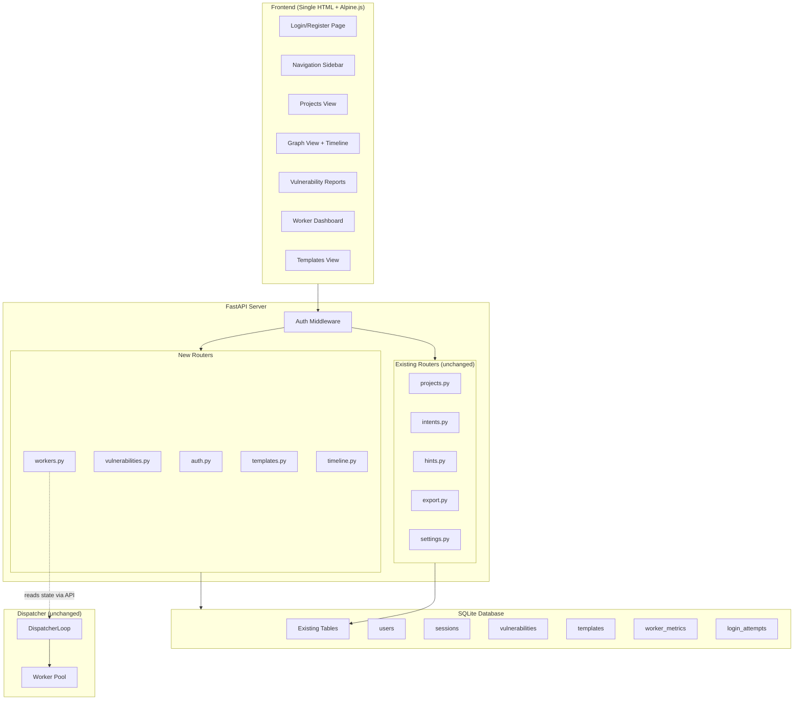
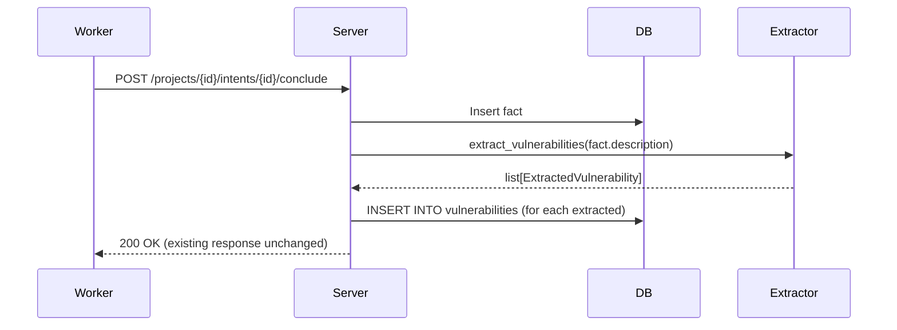
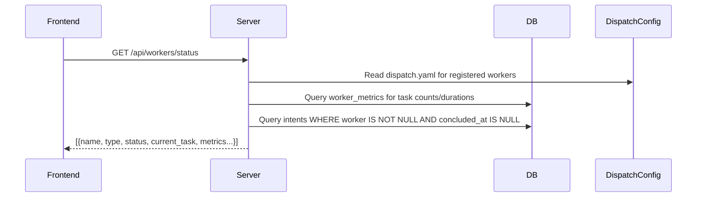

# Design Document: Rabbit Product UI

## Overview

This design transforms Rabbit from a developer-oriented single-page exploration tool into a product-grade penetration testing platform. The transformation is **additive** — all existing core functionality (dispatcher, scheduler, worker system, fact-intent graph logic, existing API endpoints) remains unchanged. New capabilities are layered on top through:

1. **Authentication middleware** wrapping existing routes
2. **New routers** for vulnerability reports, worker dashboard, templates, and timeline
3. **New database tables** for users, sessions, vulnerabilities, templates, and worker metrics
4. **Frontend evolution** from a single `index.html` to a multi-page SPA using Alpine.js hash-based routing

### Key Technical Decisions

| Decision | Choice | Rationale |
|----------|--------|-----------|
| Auth mechanism | Server-side sessions in SQLite | Simpler than JWT for a single-server deployment; session invalidation is immediate; no token refresh complexity; aligns with existing SQLite usage |
| Frontend routing | Single HTML with Alpine.js hash routing (`x-show` based) | Avoids build tooling; keeps the zero-build-step philosophy; Alpine.js already loaded; hash routing works without server-side route handling |
| Vulnerability extraction | Keyword-based heuristics with configurable patterns | Deterministic, auditable, no LLM dependency for a core feature; patterns can be extended later; avoids latency and cost of LLM calls on every fact |
| Worker status | New API endpoint that reads dispatcher state | Pull-based is simpler; dispatcher already tracks worker state in memory; avoids coupling dispatcher to server via push |

## Architecture



### Request Flow

1. Browser sends request with session cookie
2. Auth middleware validates session token against `sessions` table
3. If valid: extends session TTL, passes request to router
4. If invalid/missing: returns 401 (API) or 302 redirect to login (HTML)
5. Auth-exempt routes (login, register, static assets) bypass middleware

## Components and Interfaces

### Authentication Module

**File:** `cairn/src/cairn/server/auth.py`

```python
# Core auth functions
def hash_password(password: str) -> str: ...
def verify_password(password: str, hashed: str) -> bool: ...
def generate_session_token() -> str: ...  # 128+ bits entropy via secrets.token_hex(32)
def validate_username(username: str) -> str | None: ...  # Returns error message or None
def validate_password(password: str) -> str | None: ...  # Returns error message or None
```

**File:** `cairn/src/cairn/server/middleware.py`

```python
from fastapi import Request, Response
from starlette.middleware.base import BaseHTTPMiddleware

EXEMPT_PATHS = {"/api/auth/login", "/api/auth/register"}
EXEMPT_PREFIXES = ("/static/",)

class AuthMiddleware(BaseHTTPMiddleware):
    async def dispatch(self, request: Request, call_next) -> Response: ...
```

**File:** `cairn/src/cairn/server/routers/auth.py`

```python
router = APIRouter(prefix="/api/auth", tags=["auth"])

@router.post("/register")      # -> {user_id, username}
@router.post("/login")         # -> {username} + Set-Cookie
@router.post("/logout")        # -> 204 + Clear-Cookie
@router.post("/password")      # -> 204 (change password)
@router.get("/me")             # -> {user_id, username}
```

### Vulnerability Report Engine

**File:** `cairn/src/cairn/server/routers/vulnerabilities.py`

```python
router = APIRouter(prefix="/api/vulnerabilities", tags=["vulnerabilities"])

@router.get("/")               # -> list of vulnerabilities with filters
@router.get("/summary")        # -> counts by severity
@router.get("/export")         # -> JSON or CSV file download
```

**File:** `cairn/src/cairn/server/vulnerability_extractor.py`

```python
SEVERITY_PATTERNS: dict[str, list[re.Pattern]] = {
    "critical": [...],  # RCE, auth bypass, SQL injection patterns
    "high": [...],      # XSS, SSRF, privilege escalation patterns
    "medium": [...],    # Information disclosure, CSRF patterns
    "low": [...],       # Missing headers, verbose errors patterns
}

def extract_vulnerabilities(fact_description: str) -> list[ExtractedVulnerability]: ...
def categorize_severity(description: str) -> str: ...
```

### Worker Dashboard

**File:** `cairn/src/cairn/server/routers/workers.py`

```python
router = APIRouter(prefix="/api/workers", tags=["workers"])

@router.get("/status")         # -> list of worker statuses (reads dispatcher config + DB metrics)
@router.get("/{worker_name}/history")  # -> recent task history for a worker
```

The worker status endpoint reads from:
1. The dispatcher config file (`dispatch.yaml`) for registered workers and their types
2. The `worker_metrics` table for completed task counts, average durations
3. The existing `intents` table for currently active tasks (intents with a `worker` field set and no `concluded_at`)

### Template Engine

**File:** `cairn/src/cairn/server/routers/templates.py`

```python
router = APIRouter(prefix="/api/templates", tags=["templates"])

@router.get("/")               # -> list of built-in + user custom templates
@router.post("/")              # -> create custom template
@router.delete("/{template_id}")  # -> delete custom template
```

**Built-in templates** are defined as a Python constant (no DB storage needed):

```python
BUILTIN_TEMPLATES = [
    {
        "id": "builtin-web-app",
        "title": "Web Application Assessment",
        "origin": "Target web application at [URL] with [technology stack]",
        "goal": "Identify and document all exploitable vulnerabilities in the web application",
        "hints": [
            {"content": "Start with reconnaissance: enumerate subdomains, directories, and technologies", "creator": "template"},
            {"content": "Test authentication mechanisms for bypass vulnerabilities", "creator": "template"},
            {"content": "Check for injection points in all user inputs", "creator": "template"},
        ]
    },
    # ... Internal Network, External Network, CTF Challenge
]
```

### Attack Timeline

**File:** `cairn/src/cairn/server/routers/timeline.py`

```python
router = APIRouter(prefix="/api/projects/{project_id}/timeline", tags=["timeline"])

@router.get("/")  # -> chronological list of timeline events
```

Timeline events are derived from existing data (facts and intents) — no new table needed. The endpoint queries facts and intents, merges them chronologically, and returns typed events.

## Data Models

### New Database Tables

```sql
-- User accounts
CREATE TABLE IF NOT EXISTS users (
    id TEXT PRIMARY KEY,
    username TEXT NOT NULL,
    username_lower TEXT NOT NULL UNIQUE,  -- for case-insensitive uniqueness
    password_hash TEXT NOT NULL,
    created_at TEXT NOT NULL,
    disabled INTEGER NOT NULL DEFAULT 0
);

-- Server-side sessions
CREATE TABLE IF NOT EXISTS sessions (
    token TEXT PRIMARY KEY,
    user_id TEXT NOT NULL REFERENCES users(id) ON DELETE CASCADE,
    expires_at TEXT NOT NULL,
    created_at TEXT NOT NULL
);

-- Login rate limiting
CREATE TABLE IF NOT EXISTS login_attempts (
    id INTEGER PRIMARY KEY AUTOINCREMENT,
    username_lower TEXT NOT NULL,
    attempted_at TEXT NOT NULL,
    success INTEGER NOT NULL DEFAULT 0
);

-- Extracted vulnerabilities (materialized from facts)
CREATE TABLE IF NOT EXISTS vulnerabilities (
    id TEXT PRIMARY KEY,
    project_id TEXT NOT NULL REFERENCES projects(id) ON DELETE CASCADE,
    fact_id TEXT NOT NULL,
    title TEXT NOT NULL,
    description TEXT NOT NULL,
    severity TEXT NOT NULL CHECK(severity IN ('critical', 'high', 'medium', 'low')),
    discovered_at TEXT NOT NULL
);

-- Custom project templates
CREATE TABLE IF NOT EXISTS templates (
    id TEXT PRIMARY KEY,
    user_id TEXT NOT NULL REFERENCES users(id) ON DELETE CASCADE,
    title TEXT NOT NULL,
    origin TEXT NOT NULL,
    goal TEXT NOT NULL,
    hints_json TEXT NOT NULL DEFAULT '[]',  -- JSON array of {content, creator}
    created_at TEXT NOT NULL
);

-- Worker task metrics (populated when intents conclude)
CREATE TABLE IF NOT EXISTS worker_metrics (
    id INTEGER PRIMARY KEY AUTOINCREMENT,
    worker_name TEXT NOT NULL,
    project_id TEXT NOT NULL,
    intent_id TEXT NOT NULL,
    task_type TEXT NOT NULL,
    started_at TEXT NOT NULL,
    completed_at TEXT NOT NULL,
    duration_seconds REAL NOT NULL,
    outcome TEXT NOT NULL CHECK(outcome IN ('success', 'failed', 'rejected', 'released'))
);
```

### New Pydantic Models

```python
# Auth models
class RegisterRequest(BaseModel):
    username: str  # 3-32 chars, [a-zA-Z0-9_-]
    password: str  # 8-72 chars

class LoginRequest(BaseModel):
    username: str
    password: str

class PasswordChangeRequest(BaseModel):
    current_password: str
    new_password: str  # 8-128 chars, 1 upper, 1 lower, 1 digit, 1 special

class UserResponse(BaseModel):
    user_id: str
    username: str

# Vulnerability models
class Vulnerability(BaseModel):
    id: str
    project_id: str
    project_name: str
    fact_id: str
    title: str
    description: str
    severity: Literal["critical", "high", "medium", "low"]
    discovered_at: str

class VulnerabilitySummary(BaseModel):
    critical: int
    high: int
    medium: int
    low: int

class VulnerabilityFilter(BaseModel):
    severity: str | None = None
    project_id: str | None = None

# Worker models
class WorkerStatus(BaseModel):
    name: str
    type: str
    status: Literal["idle", "busy", "offline"]
    current_task: str | None = None  # truncated to 120 chars
    tasks_completed: int
    avg_duration_seconds: float | None
    last_heartbeat_seconds_ago: float | None

class WorkerTaskHistory(BaseModel):
    project_name: str
    task_type: str
    description: str
    started_at: str
    duration_seconds: float
    outcome: Literal["success", "failed", "rejected", "released"]

# Template models
class ProjectTemplate(BaseModel):
    id: str
    title: str
    origin: str
    goal: str
    hints: list[dict[str, str]]  # [{content, creator}]
    is_builtin: bool
    user_id: str | None = None

class CreateTemplateRequest(BaseModel):
    title: str       # 1-200 chars
    origin: str      # 1-200 chars
    goal: str        # 1-200 chars
    hints: list[dict[str, str]]  # 0-10 items

# Timeline models
class TimelineEvent(BaseModel):
    id: str
    event_type: Literal["fact_discovery", "intent_declaration", "intent_conclusion", "project_completion"]
    description: str
    timestamp: str
    actor: str | None = None  # worker or creator name
    node_id: str | None = None  # fact_id or intent_id for graph linking
```

### Integration with Existing Schema

The new tables are added via a schema migration approach:
- On server startup, after the existing `SCHEMA` is applied, a new `SCHEMA_V2` string is executed
- Uses `CREATE TABLE IF NOT EXISTS` so it's idempotent
- No modifications to existing tables

```python
# In db.py, appended after existing SCHEMA
SCHEMA_V2 = """
CREATE TABLE IF NOT EXISTS users (...);
CREATE TABLE IF NOT EXISTS sessions (...);
...
"""
```

### Vulnerability Extraction Flow



The extraction happens synchronously during fact creation. Since it's keyword-based pattern matching (no LLM calls), it adds negligible latency (<1ms).

### Worker Status Flow



Worker status is determined by:
- **busy**: has an active intent (worker field set, not concluded)
- **offline**: last heartbeat exceeds configured timeout
- **idle**: registered but neither busy nor offline


## Correctness Properties

*A property is a characteristic or behavior that should hold true across all valid executions of a system — essentially, a formal statement about what the system should do. Properties serve as the bridge between human-readable specifications and machine-verifiable correctness guarantees.*

### Property 1: Registration creates valid session

*For any* valid username (3-32 chars, `[a-zA-Z0-9_-]`) and valid password (8-72 chars), registering should create a user record and return a session token that expires within 24 hours (±1 second) of creation time.

**Validates: Requirements 1.1**

### Property 2: Username case-insensitive uniqueness

*For any* registered username and any case-variant of that username (e.g., "Alice" vs "aLiCe"), attempting to register the case-variant should be rejected with a conflict error.

**Validates: Requirements 1.2, 1.5**

### Property 3: Password stored as bcrypt with cost 12+

*For any* successfully registered user, the stored password hash should be a valid bcrypt hash with a cost factor of at least 12, and verifying the original password against the hash should succeed.

**Validates: Requirements 1.3**

### Property 4: Invalid registration input rejected

*For any* username that is shorter than 3 characters, longer than 32 characters, or contains characters outside `[a-zA-Z0-9_-]`, OR *for any* password shorter than 8 characters or longer than 72 characters, registration should be rejected with a validation error and no user record should be created.

**Validates: Requirements 1.4, 1.6**

### Property 5: Login produces high-entropy session token

*For any* registered user, logging in with correct credentials should produce a session token of at least 32 hex characters (128 bits of entropy) with an expiration 24 hours from login time.

**Validates: Requirements 2.1**

### Property 6: Failed login gives generic error

*For any* non-existent username or incorrect password, the login response should return the same error structure and status code, without revealing whether the username or password was the cause of failure.

**Validates: Requirements 2.2**

### Property 7: Invalid session tokens are rejected

*For any* random string that is not a valid session token in the store, OR *for any* session token whose `expires_at` is in the past, making an authenticated request should return a 401 status code and a Set-Cookie header that clears the session cookie.

**Validates: Requirements 3.2, 3.6, 5.4**

### Property 8: Session sliding expiration

*For any* valid session, making an authenticated request should update the session's `expires_at` to be approximately `now + configured_period`, where the new expiration is strictly later than the previous expiration (assuming the request occurs before the original expiry).

**Validates: Requirements 3.5**

### Property 9: Password change round-trip

*For any* authenticated user with a valid current password and a new password meeting the policy (8-128 chars, 1 uppercase, 1 lowercase, 1 digit, 1 special), changing the password should allow login with the new password and reject login with the old password. All other active sessions for that user should be invalidated.

**Validates: Requirements 4.1, 4.3**

### Property 10: Invalid password change rejected

*For any* incorrect current password OR *for any* new password that does not meet the policy, the password change request should be rejected and the stored hash should remain unchanged (login with original password still works).

**Validates: Requirements 4.2, 4.4**

### Property 11: Route protection

*For any* API endpoint not in the exempt list (`/api/auth/register`, `/api/auth/login`, `/static/*`), making a request without a valid session cookie should return 401. *For any* non-API HTML path, making a request with `Accept: text/html` without a valid session should return 302 redirecting to the login page.

**Validates: Requirements 5.1, 5.3**

### Property 12: Vulnerability extraction produces valid output

*For any* fact description that matches a security-relevant pattern (containing terms like "SQL injection", "XSS", "RCE", etc.), the extraction function should produce exactly one vulnerability with a severity in `{critical, high, medium, low}`, a non-empty title, and a reference to the source project.

**Validates: Requirements 6.1, 6.2, 6.4**

### Property 13: Vulnerability cascade on project deletion

*For any* project that has associated vulnerabilities, deleting the project should result in zero vulnerabilities referencing that project ID in the database.

**Validates: Requirements 6.5**

### Property 14: Vulnerability filter conjunction

*For any* combination of severity filter and project filter applied to a set of vulnerabilities, every vulnerability in the result set should satisfy ALL active filter criteria. The result set should contain ALL vulnerabilities from the full set that match all criteria (no false exclusions).

**Validates: Requirements 7.1, 7.2, 7.3**

### Property 15: Filter clear returns complete list

*For any* set of vulnerabilities and any previously applied filter combination, clearing all filters should return the complete unfiltered list with the same count as the total vulnerabilities in the database.

**Validates: Requirements 7.5**

### Property 16: JSON export matches filtered data

*For any* set of vulnerabilities matching the current filters, the JSON export should contain exactly those vulnerabilities (same count, same IDs), each with severity, description, and project name fields. The summary section should have counts that sum to the total number of exported vulnerabilities.

**Validates: Requirements 8.1, 8.3**

### Property 17: CSV export matches filtered data

*For any* set of vulnerabilities matching the current filters, the CSV export should have one data row per vulnerability with columns for severity, title, description, project name, and discovery date. The header summary rows should have counts matching the actual data rows.

**Validates: Requirements 8.2, 8.3**

### Property 18: Invalid export format rejected

*For any* format string that is not "json" or "csv", requesting an export should return an error indicating the supported formats.

**Validates: Requirements 8.4**

### Property 19: Task description truncation

*For any* task description string, the displayed value in the worker dashboard should be at most 120 characters. If the original is longer than 120 characters, the displayed value should be the first 120 characters (or first 117 + "...").

**Validates: Requirements 9.4**

### Property 20: Worker metrics computation

*For any* worker with N completed tasks (N > 0) having durations [d1, d2, ..., dN], the displayed task count should equal N and the displayed average duration should equal `round(sum(durations) / N, 1)`.

**Validates: Requirements 10.1, 10.2**

### Property 21: Heartbeat-based worker status

*For any* worker, if the time since last heartbeat exceeds the configured timeout, the worker status should be "offline". If the worker has running tasks, status should be "busy". Otherwise, status should be "idle".

**Validates: Requirements 10.4, 10.5**

### Property 22: Task history returns 20 most recent with all fields

*For any* worker with M task history entries (M >= 0), requesting history should return `min(M, 20)` entries sorted by most recent first. Each entry should contain project_name, task_type, description, started_at, duration, and outcome (one of: success, failed, rejected, released).

**Validates: Requirements 11.1, 11.2, 11.3**

### Property 23: Template data round-trip

*For any* valid template data (title 1-200 chars, origin 1-200 chars, goal 1-200 chars, 0-10 hints), saving a custom template and then retrieving it should return identical field values.

**Validates: Requirements 13.1, 12.2, 13.3**

### Property 24: Template ownership enforcement

*For any* custom template created by user A, attempting to delete it as user B (where A ≠ B) should be rejected with an ownership error, and the template should remain in the list.

**Validates: Requirements 13.5**

### Property 25: Timeline chronological ordering

*For any* project with timeline events, the returned event list should be sorted by timestamp ascending, with declaration order (insertion order) as tiebreaker for events sharing the same timestamp.

**Validates: Requirements 14.1**

### Property 26: Timeline events contain required fields

*For any* timeline event, the response should include a non-empty description, a valid ISO timestamp, an event_type from `{fact_discovery, intent_declaration, intent_conclusion, project_completion}`, and for intent-related events, a non-null actor field.

**Validates: Requirements 14.3, 14.4**

### Property 27: Username display truncation

*For any* username, the displayed value in the navigation header should be at most 20 characters. If the original username is longer than 20 characters, the displayed value should end with an ellipsis ("…").

**Validates: Requirements 16.3**

## Error Handling

### Authentication Errors

| Scenario | HTTP Status | Response |
|----------|-------------|----------|
| Missing/empty credentials | 422 | Validation error with field details |
| Invalid username format | 422 | Validation error with format requirements |
| Username taken | 409 | `{"detail": "Username already taken"}` |
| Invalid credentials (login) | 401 | `{"detail": "Invalid credentials"}` |
| Rate limited | 429 | `{"detail": "Too many attempts. Try again later."}` |
| Expired/invalid session | 401 | `{"detail": "Authentication required"}` + clear cookie |
| Wrong current password (change) | 401 | `{"detail": "Invalid current credentials"}` |
| New password policy failure | 422 | Validation error with policy requirements |

### Vulnerability Report Errors

| Scenario | HTTP Status | Response |
|----------|-------------|----------|
| Invalid severity filter value | 422 | Validation error |
| Project not found (filter) | 404 | `{"detail": "Project not found"}` |
| Unsupported export format | 422 | `{"detail": "Supported formats: json, csv"}` |

### Worker Dashboard Errors

| Scenario | HTTP Status | Response |
|----------|-------------|----------|
| Dispatcher unreachable | 503 | `{"detail": "Worker status unavailable", "last_updated": "..."}` |
| Worker not found | 404 | `{"detail": "Worker not found"}` |

### Template Errors

| Scenario | HTTP Status | Response |
|----------|-------------|----------|
| Template limit reached (50) | 409 | `{"detail": "Template limit reached (50)"}` |
| Delete non-owned template | 403 | `{"detail": "Cannot delete template owned by another user"}` |
| Invalid template fields | 422 | Validation error with field details |
| Template not found | 404 | `{"detail": "Template not found"}` |

### General Error Handling Strategy

- All errors return JSON with a `detail` field for consistency with FastAPI conventions
- Authentication errors never reveal whether username or password was wrong
- Database constraint violations (UNIQUE, FK) are caught and translated to appropriate HTTP errors
- The dispatcher state endpoint uses a circuit-breaker pattern: after 3 consecutive failures, the workers router returns cached data with a staleness indicator

## Testing Strategy

### Property-Based Testing

**Library:** [Hypothesis](https://hypothesis.readthedocs.io/) (Python PBT library)

**Configuration:**
- Minimum 100 examples per property test
- Each test tagged with: `# Feature: cairn-product-ui, Property {N}: {title}`
- Hypothesis profiles: `ci` (200 examples), `dev` (100 examples)

**Property tests cover:**
- Registration validation (Properties 1-4)
- Session management (Properties 5-8)
- Password change logic (Properties 9-10)
- Route protection (Property 11)
- Vulnerability extraction and filtering (Properties 12-18)
- Worker metrics computation (Properties 19-22)
- Template CRUD and ownership (Properties 23-24)
- Timeline ordering and completeness (Properties 25-26)
- Display truncation (Property 27)

### Unit Tests (Example-Based)

- Rate limiting: 5 failures then lockout, expiry after 15 minutes
- Built-in templates: verify all 4 exist with correct structure
- Template limit: create 50, verify 51st rejected
- Cookie attributes: verify HttpOnly, Secure, SameSite=Strict
- Empty states: zero vulnerabilities, no timeline events, no task history
- Logout: session invalidated, redirect to login

### Integration Tests

- Full registration → login → access protected route → logout flow
- Vulnerability extraction triggered by new fact addition (within 5s)
- Worker dashboard reads live dispatcher state
- Template → project creation end-to-end
- Export generation performance (< 30s for large datasets)
- Filter performance (< 3s for 10,000 vulnerabilities)

### Test Organization

```
tests/
├── unit/
│   ├── test_auth_service.py          # Properties 1-11
│   ├── test_vulnerability_engine.py  # Properties 12-18
│   ├── test_worker_metrics.py        # Properties 19-22
│   ├── test_templates.py             # Properties 23-24
│   └── test_timeline.py             # Properties 25-27
├── integration/
│   ├── test_auth_flow.py
│   ├── test_vulnerability_refresh.py
│   ├── test_worker_dashboard.py
│   └── test_template_project.py
└── conftest.py                       # Shared fixtures, test DB setup
```

### Dependencies to Add

```toml
[dependency-groups]
dev = [
    "pytest>=8.0",
    "hypothesis>=6.100",
    "httpx>=0.27",          # async test client for FastAPI
    "pytest-asyncio>=0.23",
]
```

Production dependencies:
```toml
dependencies = [
    # ... existing ...
    "bcrypt>=4.1",
]
```
