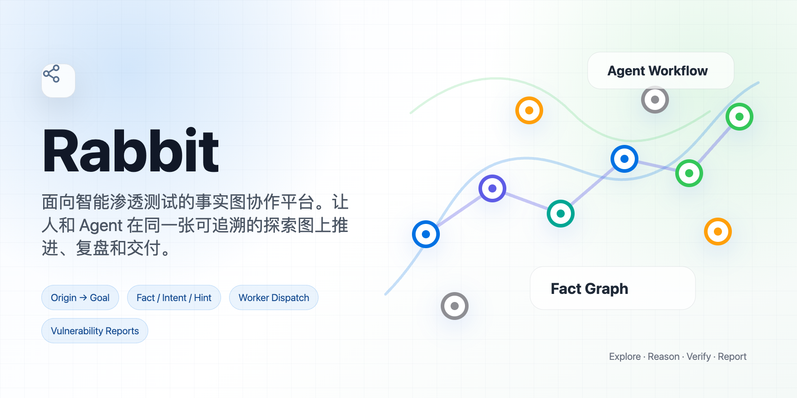
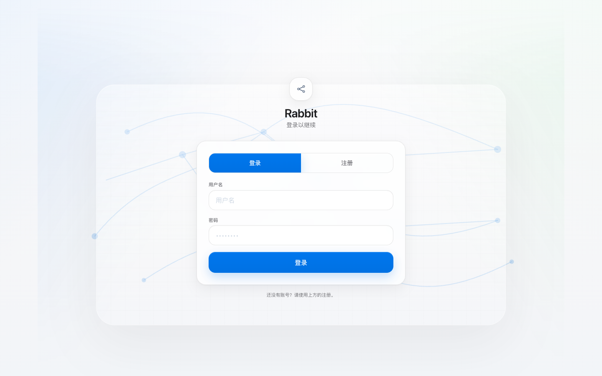
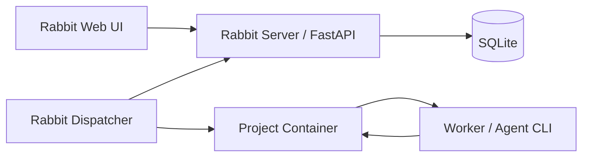

# Rabbit



Rabbit 是一个面向智能渗透测试和目标导向探索的事实图工作台。它把一次测试过程拆成可追溯的事实、意图、提示和结论，让人和 Agent 在同一个工作面上推进任务，并把过程沉淀成可复盘的漏洞报告。

当前工程目录和 Python CLI 仍保留 `cairn` 命名，这是为了兼容现有代码结构；产品界面和文档统一使用 Rabbit。

## 预览

### 登录与注册



### 项目工作台


## 核心能力

- 事实图探索：用 Origin、Goal、Fact、Intent、Hint 记录安全测试过程。
- 项目管理：支持创建、停止、重新打开、完成、删除和快照查看。
- Agent 调度：Dispatcher 将项目状态转成 `bootstrap`、`reason`、`explore` 任务并分发给 Worker。
- 工作节点面板：查看 Worker 在线状态、当前任务、任务历史和心跳情况，并可在前端新增、编辑、测试模型配置。
- 漏洞报告：从项目事实中提取漏洞，按项目折叠展示，支持严重程度和项目筛选。
- Markdown 报告导出：支持项目级和单漏洞级导出，包含漏洞清单、关键证据、证明数据包和漏洞浮现过程。
- 模板管理：提供常见测试场景模板，并支持自定义模板。
- 认证体系：支持注册、登录、退出、修改密码、验证码和服务端 Session。

## 工作模型

Rabbit 的核心不是一次性给出扫描结果，而是维护一张持续增长的事实图：

- `Origin`：项目起点，例如目标地址、范围、入口信息。
- `Goal`：项目目标，例如确认漏洞、拿到权限证明、完成靶场任务。
- `Fact`：已经确认的事实，只追加，不覆盖历史。
- `Intent`：从事实出发的探索方向或待执行任务。
- `Hint`：人工补充的提示，用于影响后续探索但不直接替代事实。

这种结构让漏洞报告可以反向追溯：一个漏洞来自哪个项目、哪个事实、哪个 Worker、哪些证据和哪些探索步骤。

## 架构



- Web UI：项目、图谱、漏洞报告、Worker、模板和账号界面。
- Server：协议接口、认证、数据存储、漏洞提取和静态资源服务。
- Dispatcher：调度循环、Worker 选择、任务超时和结果写回。
- Project Container：每个项目独立执行环境，承载 Agent 和安全测试工具。

## 快速启动

### Docker Compose

推荐使用 Compose 启动完整环境：

```bash
docker compose up --build
```

访问：

```text
http://127.0.0.1:8000/
```

首次使用请在登录页切换到注册，创建自己的账号。

数据默认保存在：

```text
./datas/cairn/
```

### 本地开发

只启动 Server：

```bash
cd cairn
uv sync
uv run cairn serve --host 127.0.0.1 --port 8765 --log-level info
```

访问：

```text
http://127.0.0.1:8765/
```

本地默认数据库：

```text
~/.local/share/cairn/cairn.db
```

## Dispatcher 配置

仓库根目录包含两个调度配置：

```text
dispatch.yaml
dispatch_mock.yaml
```

常用字段：

- `server`：Rabbit Server 地址。
- `runtime.interval`：调度循环间隔。
- `runtime.max_workers`：全局 Worker 并发上限。
- `runtime.max_running_projects`：同时运行的项目数。
- `runtime.max_project_workers`：单项目 Worker 并发上限。
- `tasks.bootstrap/reason/explore`：不同任务阶段的超时和行为限制。
- `container.image`：项目执行容器镜像。
- `workers[]`：Worker 名称、类型、可执行任务、并发和环境变量。

`dispatch.yaml` 仍然是启动时的兼容配置来源；运行后也可以在 Web UI 的“工作节点”页面新增、编辑和测试 Worker。前端会通过 Dispatcher 内部接口验证配置并写回 YAML，密钥字段只显示掩码。

公开仓库前请检查 `dispatch.yaml`，不要提交真实 API Key、Token、内部地址或其他敏感配置。

## 漏洞报告

漏洞报告页会把发现结果按项目聚合。每个项目可以展开查看单条漏洞，单条漏洞内包含：

- 基本信息：严重程度、确认事实、关联事实、来源意图和工作节点。
- 漏洞描述：合并同一项目内相同漏洞编号或同类漏洞的最终确认描述。
- 关键证据：保留可证明漏洞存在的核心输出。
- 漏洞证明数据包：以 Markdown 代码块展示请求和响应/回显。
- 漏洞浮现过程：按 Origin、Intent、Fact 追溯漏洞如何被发现。

当前 UI 只保留 Markdown 导出：

- 项目行 `导出 MD`：导出该项目的漏洞报告。
- 单漏洞详情 `导出 MD`：导出当前漏洞的独立报告。

导出文件名会按范围生成，例如：

```text
proj_004.md
proj_004-f014.md
```

## 目录结构

```text
.
├── cairn/                    # Python 工程目录
│   ├── src/cairn/server/     # Server、路由、认证、模型和静态前端
│   ├── src/cairn/dispatcher/ # 调度器、任务模型和 Worker 适配
│   └── tests/                # 后端测试
├── container/                # 项目执行容器
├── docs/specs/               # 协议和调度设计文档
├── README/                   # README 图片资源
├── dispatch.yaml             # 调度配置
├── dispatch_mock.yaml        # Mock 调度配置
└── docker-compose.yaml       # Server + Dispatcher 编排
```

## 测试

```bash
cd cairn
uv run --with pytest --with httpx python -m pytest
```

## 文档

- [Rabbit 协作探索协议](docs/specs/server-protocol.md)
- [Rabbit Dispatcher 设计](docs/specs/dispatcher-design.md)

## 致谢

Rabbit 的事实图协作思路受到 [oritera/Cairn](https://github.com/oritera/Cairn) 启发。感谢原项目对 Fact / Intent / Hint 协作探索模型和 Agent 工作流方向的开源贡献。

本仓库在此基础上继续做 Rabbit 自己的产品化实现，包括 Web 体验、认证体系、Worker 工作台、模板管理、时间线、漏洞报告和本地化安全测试流程。

## License

本项目遵循仓库中的 [AGPL-3.0 license](LICENSE)。
