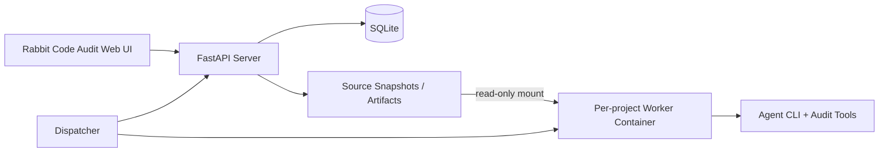

# Rabbit Code Audit

Rabbit Code Audit 是一套独立的源码安全审计工作台。它复用 Rabbit 的 Fact / Intent / Hint / Dispatcher / Worker 协作模型，但不与渗透测试系统混在一起。

系统围绕不可变源码快照维护一张持续增长的审计事实图。扫描器结果只作为导航候选，正式报告只包含经过代码证据验证并确认的发现。

当前工程目录和 Python CLI 保留 `cairn` 命名，以兼容现有代码结构。

## 核心能力

- 源码导入：支持公开 HTTP/HTTPS Git 仓库和 ZIP 上传。
- 安全限制：ZIP 压缩包最大 1 GiB，限制解压大小、文件数量、单文件大小，并阻止路径穿越、符号链接和重复路径。
- 不可变快照：记录 Git commit、压缩包 SHA-256、快照 SHA-256、文件数量、总大小和语言分布。
- 轻量索引：为源码文件记录路径、大小、SHA-256、语言和二进制标记。
- 多语言工具计划：按仓库语言和依赖清单生成 Semgrep、Gitleaks、OSV-Scanner、Trivy、PHP、Python、Go、JavaScript/TypeScript 等工具计划。
- 事实图审计：Worker 将仓库事实、调查方向、审计证据和剩余不确定性维护在统一图中。
- 结构化发现：Worker 可以提交审计发现，候选发现可以被确认、驳回或标记为证据不足。
- 发现确认：严重和高危发现创建后保留确认状态，正式报告只导出已确认发现。
- 正式报告：只有已确认的审计发现会进入报告和导出链路。
- 隔离执行：每个项目使用独立 Worker 容器，源码快照以只读卷挂载。

## 工作模型

- `SourceSnapshot`：一次 Git 或 ZIP 导入形成的不可变源码快照。
- `CodeFile`：源码索引中的文件记录。
- `ToolFinding`：扫描器产生的候选结果，不等于漏洞。
- `AuditFinding`：Worker 基于源码证据提交的结构化安全发现。
- `Fact`：已经确认的仓库或审计事实。
- `Intent`：可由不同 Worker 并行执行的独立调查方向。
- `Hint`：人工补充的审计提示。

业务逻辑漏洞不会依赖固定发现模板。Worker 应从实际代码中的角色、状态转换、资源归属、业务不变量和调用路径推导风险。

## 架构



## 快速启动

```bash
export CAIRN_INTERNAL_TOKEN="$(openssl rand -hex 32)"
export CAIRN_DISPATCHER_INTERNAL_TOKEN="$(openssl rand -hex 32)"
docker compose up --build
```

访问：

```text
http://127.0.0.1:8765/
```

首次使用时在登录页注册账号，然后创建代码审计项目并导入公开 Git 仓库或 ZIP 文件。

`dispatch.yaml` 默认不启用 Mock Worker。请在“工作节点”页面配置实际 Worker，或使用 `dispatch_mock.yaml` 进行调度测试。

## 本地开发

```bash
cd cairn
uv sync
uv run cairn serve --host 127.0.0.1 --port 8765 --log-level info
```

前端构建：

```bash
cd cairn/frontend
npm install
npm run build
```

后端测试：

```bash
cd cairn
uv run --group dev python -m pytest
```

## 目录结构

```text
.
├── cairn/
│   ├── frontend/                  # React 前端
│   ├── src/cairn/server/          # Server、源码导入、索引、发现和报告
│   ├── src/cairn/dispatcher/      # 调度器、Worker 协议和审计提示词
│   └── tests/                     # 后端测试
├── container/                     # 多语言代码审计 Worker 镜像
├── docs/specs/                    # 设计文档
├── dispatch.yaml                  # 默认调度配置
├── dispatch_mock.yaml             # Mock 调度配置
└── docker-compose.yaml            # Server、Dispatcher 和 Worker 镜像编排
```

## 安全边界

- 源码和构建脚本始终视为不可信输入。
- 导入快照不允许 Worker 修改。
- 执行项目代码、安装依赖、运行构建脚本或测试前应先审查相关脚本。
- 工具告警不能直接进入正式漏洞报告。
- 当前版本仅支持公开 Git 仓库，不支持私有仓库凭据。

## 文档

- [代码审计系统设计](docs/specs/code-audit-design.md)
- [Server 协作协议](docs/specs/server-protocol.md)
- [Dispatcher 设计](docs/specs/dispatcher-design.md)

## License

本项目遵循仓库中的 [AGPL-3.0 license](LICENSE)。
